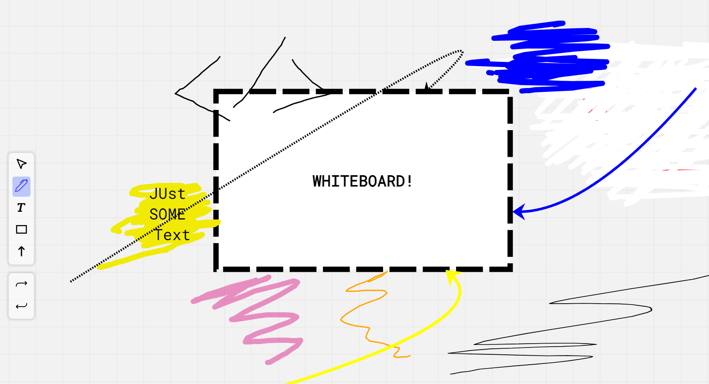

# Whiteboard  

 Whiteboard app for sketching, note taking, building mind-maps. That altogether helps think visually and make creative plans and ideas. It can be buggy in some cases.
 
This is a [Next.js](https://nextjs.org/) project bootstrapped with [`create-next-app`](https://github.com/vercel/next.js/tree/canary/packages/create-next-app). 

### [liveDemo](https://whiteboard-ten-xi.vercel.app/)
 
## Ui Screenshot 




## Key Features

- Drawing | Sketching 
    - Brush controls
        - opacity
        - thickness
        - color
        - color sets
        - type (dashed, solid)
        
- Creating Shapes | Text | Curves (Connection lines) 
    - common : CRUD operations.
    - Shape controls
        - resize
        - rotate
        - background color | opacity
        - border color | type | thickness
        - font-size, font-family
        - shapeChange
    - Curves controls
        - color
        - thickness
        - type (dashed, solid)
        - points  
    - Curves controls
        - resize
        - rotate
        - font-size, font-family
- Undo | redo functionality 
- Selection 
    - selecting by selection area.
    - select all ``` alt + A```


 


## Getting Started

First, run the development server:

```bash
npm run dev
# or
yarn dev
# or
pnpm dev
```

Open [http://localhost:3000](http://localhost:3000) with your browser to see the result.


## Learn More

To learn more about Next.js, take a look at the following resources:

- [Next.js Documentation](https://nextjs.org/docs) - learn about Next.js features and API.
- [Learn Next.js](https://nextjs.org/learn) - an interactive Next.js tutorial.

You can check out [the Next.js GitHub repository](https://github.com/vercel/next.js/) - your feedback and contributions are welcome!

